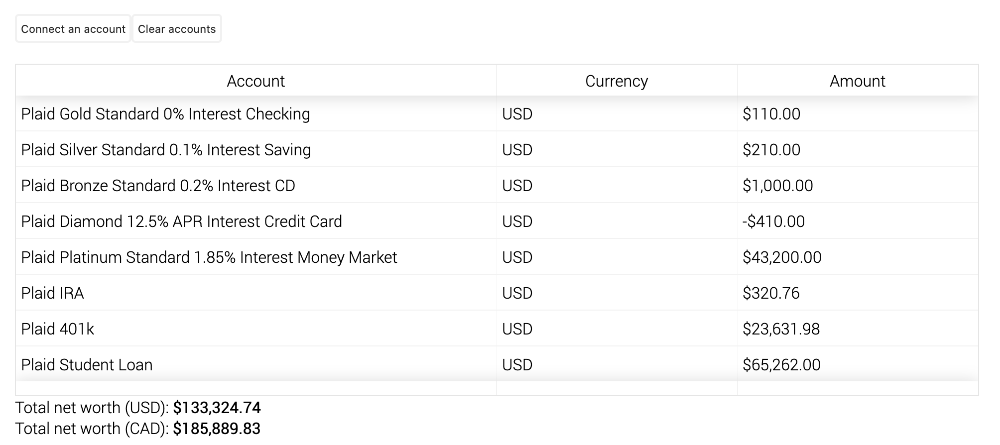

# Loonie

Loonie is a web app to monitor financial accounts such as bank accounts and credit cards in one table. I used to use mint for the same functionality, but when given diffeerent currencies, Mint simply sums the absolute value of the numbers rather than converting to a single currency.

## Demo

Try out a live demo at [itsjafer.com/#/loonie](https://itsjafer.com/#/loonie)

## How it works

Loonie uses Plaid API to connect to financial accounts and get temporary public tokens. It then communicates with a flask backend server to convert those temporary tokens into permanent access tokens that are stored as secured, same site cookies locally.
